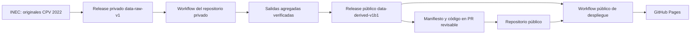

# Acceso a datos y frontera de publicación

El repositorio privado `diegocevallos-tech/censo-vivo-ecuador-raw` usa el `GITHUB_TOKEN` automático **de su propio workflow**, con `contents: read`, para descargar `data-raw-v1`. Solo el job que publica su Release derivado privado recibe `contents: write`. El checkout del código público se hace mediante `git clone` anónimo. No hay token entre repositorios ni secret en el repositorio público. La CI pública usa la muestra agregada versionada para tests y verifica la integridad del [Release derivado público](https://github.com/diegocevallos-tech/censo-vivo-ecuador/releases/tag/data-derived-v1b1) con el `GITHUB_TOKEN` del propio repositorio público y sus SHA256 contra [`data/DERIVED_MANIFEST.json`](../data/DERIVED_MANIFEST.json).

El proceso privado comprueba tamaño y SHA256 según [`data/MANIFEST.json`](../data/MANIFEST.json), lee los originales dentro del runner y publica únicamente el resultado agregado, con retención de siete días como artifact. Un mantenedor descarga ese artifact con su sesión local de `gh`, ejecuta [`pipeline/verify_public_artifacts.py`](../pipeline/verify_public_artifacts.py), revisa las columnas y publica tres paquetes comprimidos en el Release público. Solo el manifiesto, el código y una muestra inferior a 2 MB entran en git. La verificación rechaza extensiones crudas, claves de registro individual, archivos superiores a 95 MB y un sitio que supere los presupuestos de [`config.yaml`](../config.yaml).

Los originales y los archivos intermedios están ignorados por Git. Los Releases no son una fuente directa del navegador: el workflow copia los agregados verificados a `dist/data` y Pages los sirve desde el mismo origen. No existe `CENSO_RAW_READ_TOKEN` ni `RAW_READ_TOKEN`, por lo que no hay alcance ni fecha de vencimiento de un PAT que documentar.
