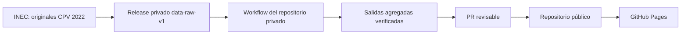

# Acceso a datos y frontera de publicación

El repositorio privado `diegocevallos-tech/censo-vivo-ecuador-raw` usa el `GITHUB_TOKEN` automático **de su propio workflow**, con `contents: read`, para descargar `data-raw-v1`. Solo el job que publica `data-derived-v0` o `data-derived-v1a` recibe `contents: write`. El checkout del código público se hace mediante `git clone` anónimo. No hay token entre repositorios ni secret en el repositorio público. Los workflows públicos leen exclusivamente archivos versionados en `web/public/data/`.

El proceso privado comprueba tamaño y SHA256 según [`data/MANIFEST.json`](../data/MANIFEST.json), lee los originales dentro del runner y publica únicamente el resultado agregado, con retención de siete días como artifact. El Release derivado se crea una vez con la sesión local del mantenedor; el job privado sube o actualiza el asset con su `GITHUB_TOKEN`. Para incorporarlo al sitio, un mantenedor descarga el artifact o el asset derivado con su sesión local de `gh`, ejecuta [`pipeline/verify_public_artifacts.py`](../pipeline/verify_public_artifacts.py), revisa las columnas y abre un PR público. La verificación rechaza extensiones crudas, archivos de 100 MB o más, claves de registro individual reconocidas y un conjunto de datos del sitio superior a 900 MB.

Los originales y los archivos intermedios están ignorados por Git. El Release privado no es una fuente del navegador; las peticiones del sitio se sirven desde Pages. No existe `CENSO_RAW_READ_TOKEN` ni `RAW_READ_TOKEN`, por lo que no hay alcance ni fecha de vencimiento de un PAT que documentar.
