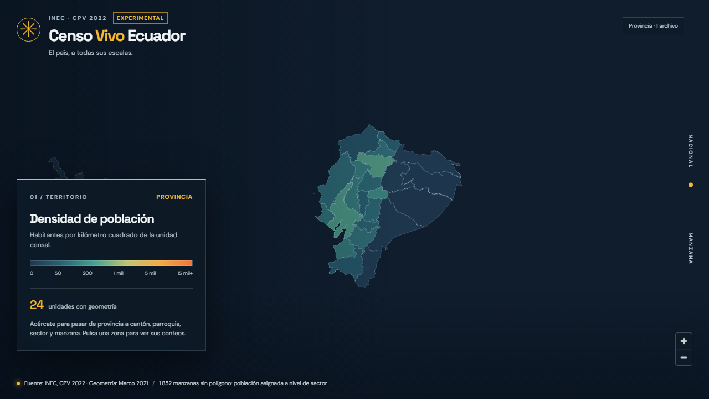

# Fase 1B-3 · cartografía y paquete web

## Fuente y unión

Los polígonos proceden del GeoPackage oficial **Marco Geográfico 2021** verificado en la [Fase 0](fase0_report.md). Las estadísticas exactas proceden de los [Parquet por unidad censal](schema.md). [`06_tiles.py`](../pipeline/06_tiles.py) une geometría y conteos **solo por clave**; todos los metadatos de salida llevan `geom_version: "marco-2021"`. Las áreas se miden sobre la geometría original en EPSG:6933; el polígono se simplifica solo para dibujarlo. Si se obtiene cartografía 2022, se regeneran los tiles sin recalcular conteos. La [issue #42](https://github.com/diegocevallos-tech/censo-vivo-ecuador/issues/42) sigue abierta.

| Nivel | Unidades censales 2022 | Polígonos 2021 unidos | PMTiles |
| --- | ---: | ---: | ---: |
| Nación | 1 | 1 | 1 |
| Provincia | 24 | 24 | 1 |
| Cantón | 221 | 221 | 1 |
| Parroquia | 1.042 | 1.042 | 1 |
| Sector | 53.513 | 52.864 | 24 provinciales |
| Manzana con polígono | 209.373 | 209.373 | 24 provinciales |

La unidad fina de conteos tiene 231.464 filas: 209.373 manzanas con polígono y 22.091 filas de nivel sector para rural disperso, códigos `888` y manzanas asignadas. Las **1.852 manzanas sin polígono** aportan 36.040 personas y 18.701 viviendas a sus sectores; no se descartan. La densidad de un sector incluye esa población. Sectores sin geometría se mantienen en los Parquet y en todos los niveles superiores, aunque no pueden colorearse. Los polígonos del Marco 2021 sin clave censal 2022 aparecen sin dato, sin inventar cifras.

## Tamaños reales del paquete

Se generaron 52 PMTiles con tippecanoe v2.79.0. Ningún PMTiles supera 90 MB; el mayor (`manzana/09.pmtiles`) pesa 14.637.118 bytes. El Release público [`data-derived-v1b`](https://github.com/diegocevallos-tech/censo-vivo-ecuador/releases/tag/data-derived-v1b) contiene cuatro archivos comprimidos. [`data/DERIVED_MANIFEST.json`](../data/DERIVED_MANIFEST.json) registra SHA256 y tamaño de cada archivo que Pages sirve.

| Categoría del sitio | Bytes | Presupuesto | Resultado |
| --- | ---: | ---: | --- |
| Conteos y Parquet | 149.130.353 | 150.000.000 | Cumple |
| PMTiles | 154.511.848 | 450.000.000 | Cumple |
| Chunks binarios | 64.162.668 | 150.000.000 | Cumple |
| Total de datos | 367.804.869 | 780.000.000 reservando app | Cumple |

Los PMTiles se reparten en nación (8.195 bytes), provincia (110.732), cantón (1.190.787), parroquia (6.574.498), sector (73.312.574) y manzana (73.312.143). La aplicación compilada ocupa menos de 2 MB; el sitio completo permanece muy por debajo del límite de 1 GB. Los Parquet usan zstd y tipos enteros mínimos. Las matrices de gemelos y LISA pasan a [chunks binarios](schema.md), preservando los Parquet intermedios fuera del sitio.

## QA y publicación

[`06_qa_chunks.py`](../pipeline/06_qa_chunks.py) comparó población y jefatura femenina en **48 chunks y 284.977 unidades** contra los Parquet, y validó otras 48 piezas de perfiles y LISA (360.632 filas de sector, con esquema explícito). La [QA de integridad](../pipeline/verify_release_integrity.py) dio diferencia cero entre unidad fina, sector, parroquia, cantón, provincia y nación, incluso en categorías. La nación mantiene 16.938.986 personas y 6.611.555 viviendas. [La verificación de artefactos](../pipeline/verify_public_artifacts.py) aceptó solo agregados, PMTiles y binarios con esquemas conocidos; ningún archivo individual superó 95 MB. Los tests Python y TypeScript y el build web pasaron. Se descargaron los cuatro assets del Release público y se restauraron **341 archivos** con tamaño y SHA256 coincidentes antes del despliegue.

El [workflow de despliegue](../.github/workflows/deploy.yml) descarga los assets del **Release público** con el `GITHUB_TOKEN` del mismo repositorio, verifica tamaño y SHA256, los copia a `dist/data` y publica en Pages. El navegador accede a Pages, no a los assets de Releases. El mapa mínimo cambia de nivel con el zoom, colorea la densidad y muestra población y nota de asignación en el popup. Se descartó CARTO Dark Matter sin token porque sus mosaicos devolvieron «API key required» durante la prueba local; el mapa usa un fondo oscuro propio hasta incorporar un basemap abierto verificable.



La [publicación de producción](https://github.com/diegocevallos-tech/censo-vivo-ecuador/actions/runs/36185327073) terminó correctamente en [GitHub Pages](https://diegocevallos-tech.github.io/censo-vivo-ecuador/). En el sitio publicado, una prueba de navegador recorrió provincia → cantón → parroquia → sector → manzana sin errores de consola ni respuestas de datos fallidas. [Captura de producción](qa/fase1b3_pages.png). Las peticiones con `Range: bytes=0-15` y `Accept-Encoding: identity` devolvieron HTTP 206, 16 bytes y `Content-Range` correcto para PMTiles de provincia y Parquet de cantón. La cabecera `identity` evita que el CDN comprima una respuesta parcial binaria.

## Reproducibilidad local

Con las salidas verificadas de 1B-1 y 1B-2 en `data/interim/` y el Marco 2021 extraído en `data/raw/`:

```sh
python pipeline/06_tiles.py --prepare
python pipeline/06_tiles.py --tile
python pipeline/06_chunks.py
python pipeline/06_aux_binary.py
python pipeline/06_package_v1b.py
python pipeline/06_qa_chunks.py
python pipeline/check_derived_manifest.py
```

Las fuentes GeoJSONL y todos los datos pesados permanecen en rutas ignoradas por Git. Solo código, documentación, manifiesto y muestra ligera se versionan.
