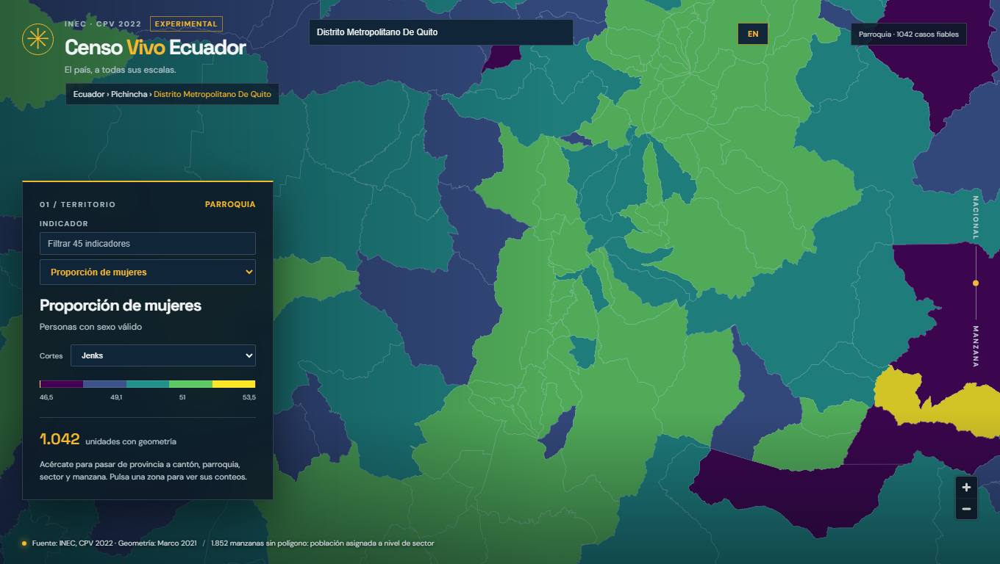

# Fase 2A · navegación e indicadores

## Visor

El mapa mantiene los seis niveles por zoom y añade búsqueda de provincia, cantón y parroquia por nombre o código, breadcrumb, estado en la URL, catálogo temático de **45 indicadores** con filtro, y cambio ES/EN. La disponibilidad por escala se toma de `min_level`: una opción se deshabilita al acercarse por debajo de su unidad mínima. Las unidades con denominador inferior a `min_n` se muestran con opacidad menor y el aviso «pocos casos»; sus valores quedan fuera del cálculo de cortes y rankings.

El usuario puede elegir cuantiles, Jenks o desviación estándar. Jenks se calcula exactamente sobre una muestra determinista de hasta 1.024 valores ordenados para mantener la respuesta del navegador; la leyenda representa esos cortes y el color se aplica a los valores reales de todas las unidades. En manzana y sector los cortes proceden de las provincias cargadas en el viewport; en los niveles superiores se usa la cobertura nacional. Para densidad, los cortes usan las unidades renderizadas del viewport. Se documenta esta referencia en la interfaz y se conserva la densidad como mapa inicial.

El [clasificador oficial de códigos y nombres del INEC 2022](https://www.censoecuador.gob.ec/informacion-geografica/) aporta 1.287 lugares buscables: 24 provincias, 221 cantones y 1.042 parroquias presentes en el Marco 2021. El archivo XLSX distribuido por el INEC contiene algunos nombres con el carácter de reemplazo `�`; el buscador conserva esa grafía de origen en vez de adivinar las tildes faltantes. Los límites de mapa se derivan de las geometrías oficiales del Marco 2021.

## Paquete y verificación

[`09_indicator_map_index.py`](../pipeline/09_indicator_map_index.py) evalúa `indicators.yaml` sobre conteos agregados exactos por unidad censal y crea un índice binario por nivel/provincia. Cada registro contiene **clave geográfica, 45 valores y estado de fiabilidad**, sin columnas ni filas por persona. El motor del mapa lee solo el archivo de su provincia; los PMTiles y las estadísticas siguen desacoplados por clave. El [Release público data-derived-v2a](https://github.com/diegocevallos-tech/censo-vivo-ecuador/releases/tag/data-derived-v2a) se restauró y verificó con SHA256: **394 archivos y 436.512.440 bytes**. Los 52 archivos nuevos suman **68.704.172 bytes**. El presupuesto queda así:

| Categoría | Bytes | Límite |
| --- | ---: | ---: |
| Conteos y Parquet | 149.130.353 | 150.000.000 |
| PMTiles | 154.511.848 | 450.000.000 |
| Chunks e índices de mapa | 132.870.239 | 150.000.000 |
| Total de datos | 436.512.440 | 780.000.000 con 20 MB reservados para app |

[`09_qa_indicator_map.py`](../pipeline/09_qa_indicator_map.py) verificó 52 archivos, **286.265 unidades** y 45 indicadores, incluidas claves únicas, longitud de registros, estados válidos y total nacional. Pasaron Ruff, 8 pruebas TypeScript y el build. La prueba de navegador abrió el mapa local, cambió cortes y el indicador, buscó Quito, mostró el breadcrumb y cambió a inglés sin errores de consola ni respuestas de datos fallidas. La publicación de 2A queda en PR de revisión; [1B-3 sigue en producción](https://diegocevallos-tech.github.io/censo-vivo-ecuador/) hasta aprobarlo.

